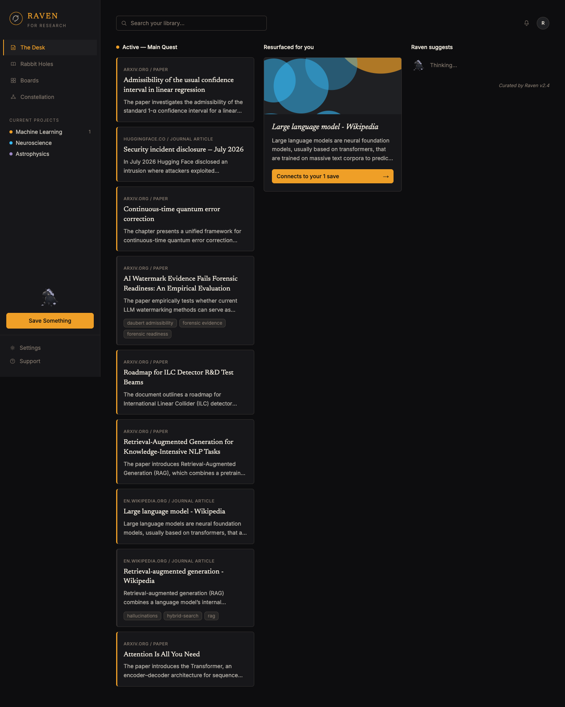
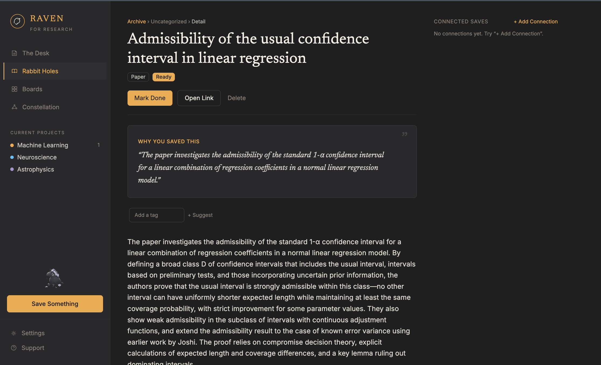
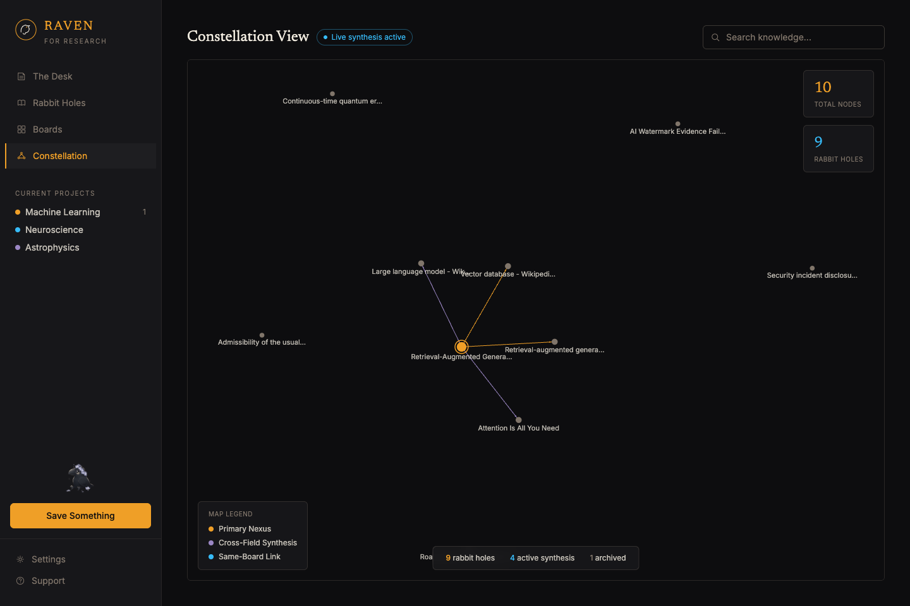
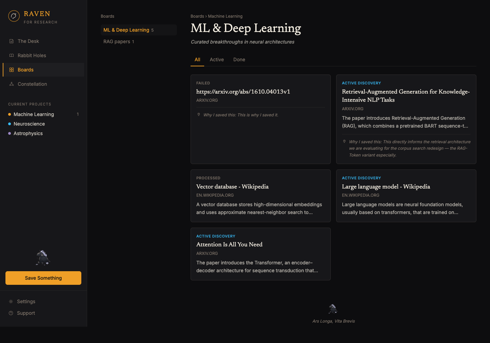

<h1 align="center">Raven for Research</h1>

<p align="center">
  
</p>

<p align="center"><em>A research desk for people who save more papers than they read.</em></p>

Raven is a personal research assistant: you throw it URLs — arXiv papers, journal
articles, blog posts, PDFs — and it fetches them, reads them, summarizes them,
embeds them, and then goes to work quietly in the background: tagging what you
saved, finding how your saves relate to each other, verifying claims against
source text, decoding gnarly equations, and resurfacing things you meant to
get back to. It's the librarian you wish you had: a little uncanny, mostly
right, and never lets a citation slide by unread.

<p align="center">
  
  <br><em>The Desk — your active reading, a resurfaced connection, and Raven's own suggestions, side by side.</em>
</p>

---

## What it actually does

### 1. Save → understand, automatically

Paste a URL. Raven detects whether it's an arXiv paper, a PDF, or a plain
article, pulls the full text, and asks an LLM to produce a structured summary
— a synopsis, the key claims, and the method, if there is one — then embeds
the summary into a vector so it's searchable later. All of this happens as a
background job; you get the item back immediately with a `pending` status and
watch it flip to `processed` in real time.

### 2. Organize without doing the organizing

- **Tags** are auto-suggested from the summary and key claims (and you can
  override or add your own).
- **Boards** group items under a **project** — a real hierarchy
  (`projects → collections/boards → items`), not a folder metaphor bolted on
  after the fact.
- **Reading status** (`active` / `done`) and a free-text **"why I saved
  this"** note let you leave yourself breadcrumbs, because six months from
  now you will not remember why a paper on quaternionic Hilbert spaces
  seemed urgent.

### 3. Semantic search over everything you've saved

`GET /search` embeds your query and does a cosine-similarity pass over every
summary in your corpus — pgvector under the hood, no keyword matching
required. Ask for "attention mechanism transformers" and it'll surface the
Transformer paper before anything that merely mentions the word "attention."

### 4. Cross-referencing that isn't just similarity

Saving a new paper doesn't just embed it — on request (`find-relations`),
Raven compares it against your most similar existing saves and asks the LLM
to classify _how_ they relate: does the new item **support**, **contradict**,
or **extend** an existing one? Each relation comes with a plain-English note,
not just a label, so "Connected saves" on an item's page reads like a
colleague's margin note, not a database join.

### 5. Claim verification, with receipts

Paste a claim — your own, or one lifted straight from an item's key claims —
and Raven checks it against the item's actual source text, not its own
summary of that text (summaries drift; source text doesn't lie). It returns
`supported` / `partially_supported` / `unsupported`, an explanation, and a
verbatim quoted excerpt when it can find one. Repeat checks against the same
claim hit a cache instead of re-running the LLM.

### 6. Math Decoder

Transformers papers are unreadable if you don't already know what `d_k`
means. Paste an equation from a saved paper and Raven — grounded in that
paper's own summary and claims, not a generic textbook explanation — returns
how to pronounce it, what each symbol actually _is_ (scalar, vector, matrix,
with shape if it can infer one), a plain-English translation, a small worked
numeric example, and why the equation matters in the context of _that
specific paper_.

<p align="center">
  
  <br><em>An item's detail page: why you saved it, its claims, its connections to other saves, and — at the bottom — the math decoder.</em>
</p>

### 7. A knowledge graph that's actually navigable

Every relation Raven has found becomes an edge in a force-directed graph.
Nodes are sized and highlighted by how connected they are (a "primary nexus"
gets a ring around it), edges are colored by relation type, and clicking a
node takes you straight to that item. It's not a decorative D3 flourish — it's
the same relations data driving "Connected saves" on the item page and
"Resurfaced for you" on the dashboard.

<p align="center">
  
  <br><em>Constellation: your corpus as a graph, not a list.</em>
</p>

### 8. Boards, properly

Filter by `All` / `Active` / `Done`, see why you saved each item without
opening it, and every board tracks a real position for each item ("this save
is the 5th item in this board") — not a display artifact, an actual ordered
membership.

<p align="center">
  
  <br><em>Boards: a curated shelf, not just a tag filtered into a grid.</em>
</p>

---

## The agentic layer

This is the part that isn't just CRUD with a summarizer bolted on. Raven runs
a real [LangGraph](https://github.com/langchain-ai/langgraph) tool-calling
agent — it decides _for itself_ which tools to reach for, in what order, and
when it has enough information to answer.

**Tools available to the agent:**

| Tool                 | What it does                                                                         |
| -------------------- | ------------------------------------------------------------------------------------ |
| `search_saved_items` | Semantic search over _your_ corpus (wraps the same pgvector search behind `/search`) |
| `arxiv_search`       | Searches arXiv directly — for papers you _haven't_ saved yet                         |
| `fetch_and_parse`    | Pulls full text from a URL on demand                                                 |
| `summarize`          | Runs the same structured-summary pipeline used on save                               |

**Where the agent shows up:**

- **`POST /agent/query`** — ask an open-ended research question
  ("What have I saved about retrieval-augmented generation?") and the agent
  decides whether to search your library, arXiv, or both, then answers with
  citations back to your actual saved items.
- **Gap-finder** — give it a topic, and it searches your saved corpus _and_
  arXiv, diffs the two, and returns papers on that topic you haven't saved
  yet. This is what powers the **"Raven suggests"** column on The Desk: on
  first load each session, Raven silently picks your most common tag,
  runs gap-finder against it, and surfaces what it found — each suggestion
  one click from being saved.
- **Cross-referencing** (`find-relations`) uses the same LLM-classification
  pattern as the agent's tool calls, just scoped to a single item instead of
  a whole conversation.

Every agent run — the query, which tools it called, which items it drew
from, and its final answer — is logged to an `agent_runs` table. That's your
eval log: if the agent starts hallucinating relevance, you have a full trace
of exactly what it searched and what it said.

**Resurfacing is agent-adjacent but deliberately not agentic** — it's a
plain ranking query (`GET /desk/resurfaced`): items with `reading_status !=
done` that you haven't opened recently (or ever), ranked first by how many
real relations they have (so "Connects to your N saves" is never decorative)
and then by how long they've been sitting unread. No LLM call needed for
something a `WHERE` clause does correctly and instantly.

---

## Architecture

```
                    ┌─────────────────────────────────────────────┐
                    │              Next.js frontend                │
                    │   The Desk · Rabbit Holes · Boards ·          │
                    │   Constellation · Agent · Gap-finder          │
                    └───────────────────┬───────────────────────────┘
                                         │ REST (fetch)
                    ┌────────────────────▼──────────────────────────┐
                    │                 FastAPI backend                │
                    │                                                │
                    │  pipeline.py ── background ingest on save      │
                    │  agent.py / agent_tools.py ── LangGraph agent  │
                    │  summarize.py / tagging.py / relations.py /    │
                    │  verify.py / decode.py ── the LLM call sites   │
                    │  repository.py ── all SQL lives here           │
                    │  llm.py ── one Groq client, shared everywhere  │
                    └──────┬───────────────────┬──────────────────┬─┘
                           │                    │                  │
                 ┌─────────▼──────┐   ┌─────────▼─────────┐  ┌────▼─────┐
                 │  Postgres +     │   │   Groq             │  │  arXiv / │
                 │  pgvector       │   │  (openai/gpt-oss-  │  │  web     │
                 │  (items,        │   │   120b)            │  │  fetch   │
                 │  summaries,     │   └────────────────────┘  └──────────┘
                 │  relations,     │
                 │  agent_runs...) │   ┌────────────────────┐
                 └─────────────────┘   │ sentence-           │
                                        │ transformers        │
                                        │ (local embeddings)  │
                                        └────────────────────┘
```

**The ingestion pipeline** (`app/pipeline.py`), triggered by `POST /items`
and run as a FastAPI background task:

1. **Detect & fetch** — arXiv ID/URL → the `arxiv` package; PDF URL →
   `pymupdf`; anything else → `trafilatura` for clean article extraction.
2. **Summarize** — one Groq chat completion, forced to return structured
   JSON (`summary`, `key_claims`, `method`), with retry-on-malformed-JSON.
3. **Embed** — the _summary_, not the full text, gets embedded locally via
   `sentence-transformers` (`all-MiniLM-L6-v2`, 384-dim) — cheaper, faster,
   and semantically denser than embedding raw boilerplate-laden source text.
4. **Persist** — `items.status` flips to `processed` (or `failed`, with the
   error message preserved) and the summary + embedding land in `summaries`.

**A few decisions worth flagging**, since they weren't the obvious defaults:

- **Embeddings are local, not API-based.** OpenRouter doesn't serve a general
  embeddings endpoint, and routing embeddings through a paid API for
  something a small local model handles well felt like the wrong tradeoff.
- **LLM backend moved from OpenRouter to Groq mid-project.** OpenRouter's
  free tier caps out at 50 requests/day — fine for single-shot summarization,
  not for a multi-step agent loop that burns several calls per query. Groq's
  free tier is a per-minute cap instead of a hard daily wall, and it's
  faster. One shared client (`app/llm.py`) meant this was a two-file change.
- **No ANN index on the embedding column.** `ivfflat`/`hnsw` need a
  reasonably large `lists` parameter relative to row count to have good
  recall — at a few dozen to a few thousand items, an exact sequential scan
  over `embedding <=> query` is both correct and fast. (An ivfflat index at
  this scale was tried and silently dropped real matches — worth knowing if
  you're tempted to add one back before the corpus is large.)
- **Reuse over new LLM call sites.** Gap-finder isn't a separate pipeline —
  it's the same agent loop with a directive prompt. Cross-reference
  classification and the agent's own tool-driven relevance judgments share
  the same "ask the LLM to classify, store the verdict + a plain-English
  note" pattern (`relations.py`, `agent_tools.py`).

---

## Tech stack

**Backend**

- [FastAPI](https://fastapi.tiangolo.com/) (async) + [uvicorn](https://www.uvicorn.org/)
- [PostgreSQL](https://www.postgresql.org/) + [pgvector](https://github.com/pgvector/pgvector) — via the `pgvector/pgvector:pg16` Docker image
- [asyncpg](https://github.com/MagicStack/asyncpg) — no ORM, hand-written SQL in `repository.py`
- [LangGraph](https://github.com/langchain-ai/langgraph) + `langchain-openai` — the agent loop
- [Groq](https://groq.com/) (`openai/gpt-oss-120b`) — summarization, tagging, relation classification, claim verification, equation decoding, and agent reasoning, all through one client
- [sentence-transformers](https://www.sbert.net/) (`all-MiniLM-L6-v2`) — local embeddings, no external API
- [trafilatura](https://trafilatura.readthedocs.io/) (HTML), [PyMuPDF](https://pymupdf.readthedocs.io/) (PDF), [`arxiv`](https://pypi.org/project/arxiv/) (arXiv metadata + fetch)

**Frontend**

- [Next.js 16](https://nextjs.org/) (App Router) + [React 19](https://react.dev/) + TypeScript
- [Tailwind CSS v4](https://tailwindcss.com/) — design tokens defined once in `globals.css`, no per-component color literals
- [react-force-graph-2d](https://github.com/vasturiano/react-force-graph) — the Constellation view
- [react-markdown](https://github.com/remarkjs/react-markdown) + `remark-gfm` — rendering the agent's markdown answers
- **Newsreader** (serif, headlines) + **Inter** (body) via `next/font/google`

**Infrastructure**

- Docker Compose for local dev (`db` + `api`); the frontend runs via `npm run dev` against it
- No Celery/Redis — background work is FastAPI `BackgroundTasks`, which is enough at this scale and one less moving part

---

## Running it locally

```bash
# 1. Backend: Postgres + pgvector + FastAPI
cp .env.example .env        # fill in GROQ_API_KEY
docker-compose up -d

# 2. Frontend
cd frontend
npm install
npm run dev
```

Open **http://localhost:3000**. The API alone is at `http://localhost:8000`
(interactive docs at `/docs`).

Database migrations live in `db/migrations/` as numbered, sequential `.sql`
files — they run automatically on a fresh `docker-compose up` (mounted into
Postgres's `docker-entrypoint-initdb.d`), or can be applied by hand to an
existing database with `psql -f db/migrations/00N_*.sql`.

---

## Project layout

```
app/                    FastAPI backend
  main.py                 route definitions
  repository.py            all SQL
  pipeline.py              background ingestion pipeline
  agent.py / agent_tools.py   LangGraph agent + its tools
  summarize.py / tagging.py / relations.py / verify.py / decode.py
                           the individual LLM call sites
  llm.py                   shared Groq client
db/migrations/           numbered, sequential schema migrations
frontend/
  app/                     Next.js App Router pages
    page.tsx                 The Desk
    rabbit-holes/             Rabbit Holes (active items)
    items/[id]/               item detail
    boards/                   Boards
    graph/                    Constellation
    agent/ · gaps/            standalone agent chat / gap-finder (reachable, not in nav)
  components/              Sidebar, Mascot, GraphCanvas, shared UI primitives
  lib/                     API client, types, tag-color mapping, formatting helpers
scripts/                  standalone test scripts for each backend pipeline stage
```

---

_Curated by Raven._
